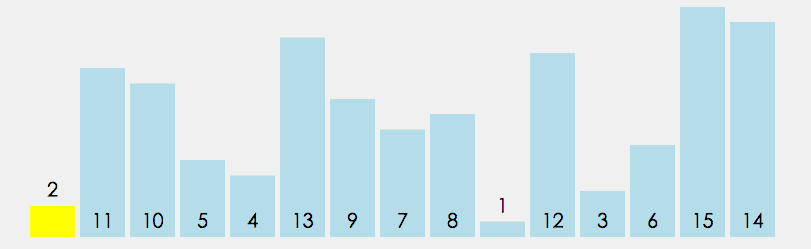

# 算法

## 排序算法

- 冒泡排序（Bubble Sort）：比较任何两个相邻的项，如果第一个比第二个大，则交换它们；元素项向上移动至正确的顺序，好似气泡上升至表面一般，因此得名。


```js
function bubbleSort(arr) {
  let len = arr.length
  for (let i = 0; i < len - 1; i++) {
    for (let j = 0; j < len - 1 - i; i++) {
      if (arr[j] > arr[j + 1]) {
        //相邻元素两两对比
        let temp = arr[j + 1] //元素交换
        arr[j + 1] = arr[j]
        arr[j] = temp
      }
    }
  }
}
```

- 选择排序（Selection Sort）：每一次从待排序的数据元素中选出最小（或最大）的一个元素，存放在序列的起始位置，以此循环，直至排序完毕。


```js
function selectionSort(arr) {
  let len = arr.length
  let minIndex, temp
  for (let i = 0; i < len - 1; i++) {
    minIndex = i
    for (let j = i + 1; j < len; j++) {
      if (arr[j] < arr[minIndex]) {
        //寻找最小的数
        minIndex = j //将最小数的索引保存
      }
    }
    temp = arr[i]
    arr[i] = arr[minIndex]
    arr[minIndex] = temp
  }
  return arr
}
```

- 插入排序（Insertion Sort）：讲一个数据插入到已经排好序的有序数据中，从而得到一个新的，个数加一的有序数据，此算法适用于少量数据的排序，时间复杂度为 O(n^2)。


```js
function insertionSort(arr) {
  let len = arr.length
  let preIndex, current
  for (let i = 1; i < len; i++) {
    preIndex = i - 1
    current = arr[i]
    while (preIndex >= 0 && arr[preIndex] > current) {
      arr[preIndex + 1] = arr[preIndex]
      preIndex--
    }
    arr[preIndex + 1] = current
  }
  return arr
}
```

- 归并排序（Merge Sort）：将原始序列切分成较小的序列，直到每个小序列无法再切分，然后在执行合并，即将小序列归并成大的序列，合并过程进行比较排序，直到最后只有一个排序完毕的大序列，时间复杂度为 O(n log n)。


```js
function mergeSort(arr) {
  let len = arr.length
  if (len < 2) {
    return arr
  }

  let middle = Math.floor(len / 2),
    left = arr.slice(0, middle),
    right = arr.slice(middle)

  return merge(mergeSort(left), mergeSort(right))
}

function merge(left, right) {
  let res = []

  while (left.length > 0 && right.length > 0) {
    if (left[0] <= right[0]) {
      res.push(left.shift()) //删除数组的第一个元素，并且将删除的元素push进res数组
    } else {
      res.push(right.shift())
    }
  }

  while (left.length) result.push(left.shift())

  while (right.length) result.push(right.shift())

  return result
}
```

- 快速排序（Quick Sort）：通过一趟排序将要排序的数据分割成独立的两部分，其中一部分的所有数据都比另外一部分的数据都要小，然后再按此方法对这两部分数据分别进行上述递归排序，以此达到整个数据变成有序序列，时间复杂度 O(n log n)。



```js
function quickSort(array, left, right) {
  var partitionIndex,
    left = typeof left == "number" ? left : 0,
    right = typeof right == "number" ? right : array.length - 1
  if (left < right) {
    partitionIndex = partition(array, left, right) //切分的基准值
    quickSort(array, left, partitionIndex - 1)
    quickSort(array, partitionIndex + 1, right)
  }
  return array
}
function partition(array, left, right) {
  //分区操作
  for (var i = left + 1, j = left; i <= right; i++) {
    //j是较小值存储位置的游标
    array[i] < array[left] && swap(i, ++j, array) //以第一个元素为基准
  }
  swap(left, j, array) //将第一个元素移至中间
  return j
}
```

----------------------------------------上面没有太懂-------------------------------------
