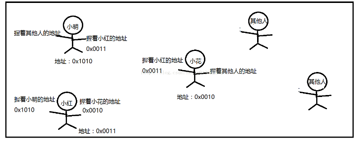

# 数据结构

是数据元素相互之间存在的一种和多种特定的关系集合，包括两个部分组成逻辑结构，存储结构。

## 逻辑结构

逻辑结构就是数据之间的关系，逻辑结构可以分为两种，一种是线性结构，一种是非线性结构。

### 线性结构

是一个有序数据元素的集合。 其中数据元素之间的关系是一对一的关系，即除了第一个和最后一个数据元素之外，其它数据元素都是首尾相接的。

常用的线性结构有: 列表（List），栈，队列，链表，线性表，集合。

- 栈：是一种特殊的线性表，规定它的插入运算，删除运算均在线性表的同一端进行，进行插入和删除的哪一端称为栈顶，另一端称为栈底。栈的插入操作和删除操作分别简称进栈和出栈。（先进后出）

* 队列：是遵循先来先服务原则的一组有序的项。队列在尾部添加新元素，并从顶部移除元素。（在现实中，最常见的队列的例子就是排队）

* 链表：是一种在物理内存上不连续的数据结构，数据元素的逻辑顺序是通过链表中的指针链接次序实现的。由一系列的结点（链表中的每一个元素称为结点）组成，结点可以在运动时动态生成。类型：单链表，双链表，有序链表。

实例理解：  
 有一条街，小明住在街中一角，他有小红的地址，然后小红也是住在这条街，她有小花的地址，同样小花也有别人的地址。某天我想找小红玩，但是我不知道她住哪里，我可以问小明，就知道小红住在哪里了。那么小明小红小花这些人之间的关系就组成一个链表。

    * 单链表：就是小明只是右手握着小红的地址，他只有小红一个人的地址

    * 双链表：就是小明左手握着小白的地址，右手握着小红的地址，他有两个人的地址

    * 循环链表：就是小明握有小红的地址，小红握有小花的地址，而小花又握有小明的地址，这样就形成了一个循环

    * 有序链表：以某个标准，给链表的元素排序，比如比较内容大小、比较哈希值等

- 集合：由一组无序且唯一（即不能重复）的项组成的。（ES6 中的 Set 类）

### 非线性结构

各个元素不再保持在一个线性序列中，每个数据元素可能与零个或者更多个其他数据元素发生联系。  
常见的非线性结构有二维数组，多维数组，广义表，树（二叉树等），图（网）等。

- 广义表：是 n(n≥0)个元素 a1，a2，…，ai，…，an 的有限序列。

      * ai--或者是原子或者是一个广义表。
      * 广义表通常记作：Ls=( a1，a2，…，ai，…，an)。
      * Ls是广义表的名字，n为它的长度。
      * 若ai是广义表，则称它为Ls的子表。

  注意：广义表通常用圆括号括起来，用逗号分隔其中的元素。为了区分原子和广义表，书写时用大写字母表示广义表，用小写字母表示原子。若广义表 Ls 非空(n≥1)，则 al 是 LS 的表头，其余元素组成的表(a1，a2，…，an)称为 Ls 的表尾。广义表是递归定义的。

* 树：是包含 n（n>=0）个结点的有穷集，其中：

  - 每个元素称为结点（node）
  - 有一个特定的结点被称为根结点或树根（root）
  - 除根结点之外的其余数据元素被分为 m（m≥0）个互不相交的集合 T1，T2，……Tm-1，其中每一个集合 Ti（1<=i<=m）本身也是一棵树，被称作原树的子树（subtree）。

  * 图：由顶点集合以及顶点间的关系集合组成的一种数据结构。Graph = (V,E) V 是顶点的又穷非空集合；E 是顶点之间关系的有穷集合，也叫边集合。

## 存储结构

逻辑结构指的是数据间的关系，而存储结构是逻辑结构用计算机语言的实现。  
常见的存储结构有顺序存储、链式存储、索引存储以及散列存储（哈希表）。
