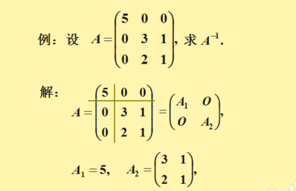
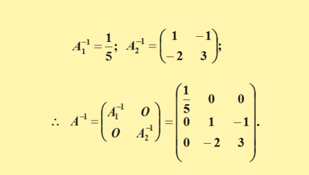
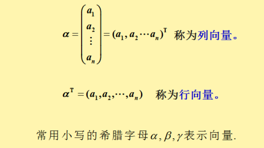

# 线性代数

1. 逆矩阵：设 A 是数域上的一个 n 阶矩阵，若在相同数域上存在另一个 n 阶矩阵 B，使得： AB=BA=E ，则我们称 B 是 A 的逆矩阵，而 A 则被称为可逆矩阵。注：E 为单位矩阵。 （矩阵的-1 次方则是代表逆矩阵的意思）
2. 矩阵运算之矩阵分块法：矩阵的分块法是讨论矩阵时一种有效的手段。  
   具体做法是：将矩阵 A 用若干纵线和横线分成许多个小矩阵，以每一个小矩阵称为 A 的一个子快，以子块为元素的矩阵称为分块矩阵。  
   示例:  
     
   
3. n 维向量：n 个数 a1,a2,...an 所组成的有序数组称为一个 n 维向量，这 n 个数称为该向量的 n 个分量，第 i 个数 ai称为第 i 个分量。（这里定义的 n 维向量就是指行（或列）矩阵）  
   示例：  
     
4.
